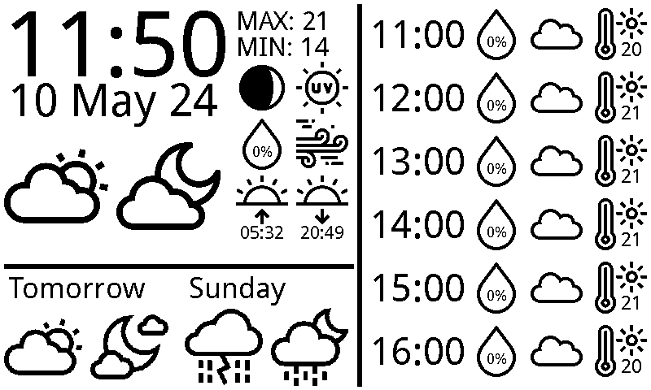

# e-ink_weatherdisplay
A framework to display weather data on e-ink screen.

## Example display

## Accuweather api
I tried several free apis to get the weather data I needed, these were either at too low resolution in time, low spacial resolution, or didn't offer the outputs I wanted.
Eventually I settled on accuweather.
There is the drawback that the api only allows 50 calls per day, but this is plenty for this project.

### API access
To get access to the api you will need to set up your own api key.
The accuweather developer website can be found here:
[https://developer.accuweather.com/](https://developer.accuweather.com/)

The easiest place to start setting up is here:
[https://developer.accuweather.com/getting-started](https://developer.accuweather.com/getting-started)

I set up a new app with the `Core Weather Limited Trial` product added.
This allows 50 API calls per day.

### API instructions:
1. Go to [https://developer.accuweather.com/getting-started](https://developer.accuweather.com/getting-started) and set up a new developer account.
2. Create a new app, and be sure to select the `Core Weather Limited Trial` product from the list.
3. Find the unique API key for the app.
4. Create the file `my_accuweather_api_key.txt`.
5. Paste this API key into `my_accuweather_api_key.txt`.
   An example of what this should look like can be seen in `my_accuweather_api_key.txt.example`.

## Location
You will want to set this up with the latitude and longitude of wherever you want the weather data to point to.
### Location instructions
1. Head to [https://www.latlong.net/](https://www.latlong.net/), and put in the location, and it should return a latitude and longitude.
2. Create the file `my_lat_lon.csv`.
3. In the newly created file `my_lat_lon.csv` paste in the location_name, latitude, and longitude.
   You may follow the example as given in `my_lat_lon.csv.example`.

## E-ink screen
I used a waveshare 800x400 e-ink screen, originally purchased here:
[https://www.waveshare.com/7.5inch-e-paper-hat.htm](https://www.waveshare.com/7.5inch-e-paper-hat.htm)
The code to draw on the screen is not very flexible as it was quicker to use pixel-based adjustments for drawing the items on screen.
If you're using a different screen, much of the code should be re-usable, but I cannot verify that items will be placed nicely.

## Raspberry pi
This project has only been verified as working nicely with a Raspberry pi zero 1.1.

## e-Paper repo
This code is built using python.
To keep the repo tidy, the following was removed:
 - c code
 - examples for other screen sizes
 - Jetson nano code

See the original repo here:
[https://github.com/waveshareteam/e-Paper](https://github.com/waveshareteam/e-Paper)

## Icons
Icon files have been gratefully downloaded from [https://www.flaticon.com/](https://www.flaticon.com/).
These are used to display the weather icons to sceen.
Examples:

## How to use
1. Ensure you have the correct version of Python installed.
   The version used for this project can be found in `python_version.txt`.
2. Create a new virtual environment, using a commend like `Python3 -m venv venv`.
3. Activate the newly created virtual environment, using `source venv/bin/activate`.
4. Install the requirements from the `requirements.txt` file to the virtual environment.
   You may use the command `pip install -r requirements.txt.` to do this.
5. The script `initialise_all.sh` should be run from the command line with `./initialise_all.sh`.
   You may need to make this executable with `chmod +x initialise_all.sh`.
6. Note that depending on when you initialise the code, the forecast might not capture the current hour.
   Simply wait and the program will correct itself within the hour.

## Options
There are three options for the user to modify.
These are found at the top of `draw.py`.

1. construction - this sets the items placed on the screen to be surrounded with a black bounding box to highlight the edges.
   This is useful to turn on when continuing development.
2. testing - if testing mode is `true`, then the output will be piped to `screen_image/img2display.png`.
   If `false`, then the img should be piped to the e-ink screen.
   This is for development and testing purposes.
3. funmode - if `true`, then little scenes will be added depending on the day.
   By default this is set to `false`.

Enjoy!
